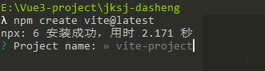
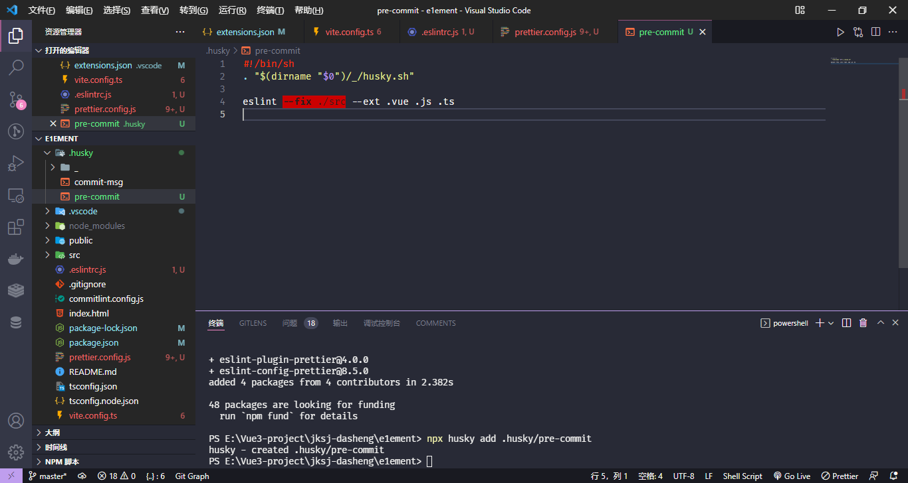

# 项目搭建

## 初始化

使用 NPM:

```powershell
 npm create vite@latest
```

使用 Yarn:

```powershell
yarn create vite
```

使用 PNPM:

```powershell
pnpm create vite
```

按照提示操作:



启动：

```powershell
npm install
npm run dev
```

## 修改 vite 配置

Vite 配置文件 vite.config.ts 位于根目录下，项目启动时会自动读取。

先做一些简单配置，例如：设置 @ 指向 src 目录、 服务启动端口、打包路径、代理等。

[vite 配置参考](https://cn.vitejs.dev/config/)

```javascript
import { defineConfig } from 'vite';
import vue from '@vitejs/plugin-vue';
import { resolve } from 'path';

const projectRootDir = resolve(__dirname);
// https://vitejs.dev/config/
export default defineConfig({
  plugins: [vue()],
  resolve: {
    alias: [
      {
        find: '@',
        replacement: resolve(projectRootDir, 'src') + '/',
      },
      // /#/xxxx => types/xxxx
      {
        find: '#',
        replacement: resolve(projectRootDir, 'types') + '/',
      },
    ],
  },
  server: {
    port: 4000, // 设置服务启动端口号
    open: true, // 设置服务启动时是否自动打开浏览器
    cors: true, // 允许跨域

    // 设置代理，根据我们项目实际情况配置
    // proxy: {
    //   '/api': {
    //     target: 'http://xxx.xxx.xxx.xxx:8000',
    //     changeOrigin: true,
    //     secure: false,
    //     rewrite: (path) => path.replace('/api/', '/')
    //   }
    // }
  },
});
```

同步修改`tsconfig`:

```json
"compilerOptions": {
  "baseUrl": "./",
    "paths": {
    "@/*": ["./src/*"],
    "#/*": ["./types/*"]
  }
}

```

## 添加 tsx 支持

安装官方维护的 vite 插件@vitejs/plugin-vue-jsx,这个插件其实核心还是@vue/babel-plugin-jsx,只是在这个插件上封装了一层供 vite 插件调用。

[jsx 语法规范](https://github.com/vuejs/babel-plugin-jsx)

```powershell
npm install @vitejs/plugin-vue-jsx -D
```

<br/>

```javascript
import vueJsx from '@vitejs/plugin-vue-jsx';

export default defineConfig({
 plugins: [vue(), vueJsx()],
}
```

# 项目规范

## 工具

- eslint：检测代码质量和代码风格
- prettier：检测代码风格
- stylelint：检测样式代码质量和风格
- editorconfig：统一不同 IDE 之间的配置差异

工作原理：上述工具的工作原理大概都是：对象实例化-->编译 javascript 代码为 AST-->深度遍历 AST 进行模式匹配-->输出检测结果

## eslint

### 安装

```
npm install eslint -D

npx eslint --init
```

根据编辑器配置文件保存时自动修复。

### 添加.eslintignore

示例：

```
# files
*.sh
*.md
*.woff
*.ttf
/public
/docs
.husky
/bin
Dockerfile

# Logs
logs
*.log
npm-debug.log*
yarn-debug.log*
yarn-error.log*
pnpm-debug.log*
lerna-debug.log*

node_modules
dist
dist-ssr
*.local

# Editor directories and files
.vscode/*
!.vscode/extensions.json
.idea
.DS_Store
*.suo
*.ntvs*
*.njsproj
*.sln
*.sw?
```

### 配置 vue-eslint-parser

The ESLint custom parser for .vue files.

.eslintrc.js 示例如下：

```
module.exports = {
  env: {
    browser: true,
    es2021: true,
    node: true,
    'vue/setup-compiler-macros': true, // 启用compiler-macros such as defineProps and defineEmits
  },
  extends: [
    'eslint:recommended',
    'plugin:vue/vue3-recommended',
    'plugin:@typescript-eslint/recommended',
    'prettier', // 防止prettier冲突
    'plugin:prettier/recommended', // 添加 prettier 插件
  ],
  parser: 'vue-eslint-parser', // 解析vue文件（template）
  parserOptions: {
    ecmaVersion: 'latest',
    parser: '@typescript-eslint/parser',
    sourceType: 'module',
    jsx: true, // 启用jsx
  },
  plugins: ['vue', '@typescript-eslint'],
  rules: {},
};
```

### 添加 npm 脚本

```json
"scripts": {
  "lint:eslint": "eslint --cache --max-warnings 0  \"{src,mock}/**/*.{vue,ts,tsx}\" --fix",
},
```

## prettier

### 为什么有了 eslint 还要 prettier？

eslint 主要负责质量检查（比如语法问题，变量定义未使用）和风格检查，prettier 则只负责风格检查及修复。在某些情况下，eslint 虽然检查出问题但是修复不了，这时候 prettier 就做到了很好的补充作用。

并且 prettier 支持 JavaScript、TypeScript、CSS、SCSS、Less、JSX、Angular、Vue、GraphQL、JSON、Markdown 等语言，基本上前端能用到的文件格式它都可以搞定，是当下最流行的代码格式化工具。

### 安装

```
npm install prettier -D
```

### 创建配置文件

Prettier 支持多种格式的配置文件，比如 .json、.yml、.yaml、.js 等。在本项目根目录下创建 .prettierrc 文件。

### 配置 prettier

常用：

```javascript
module.exports = {
  printWidth: 100, // 每行最大长度
  tabWidth: 2, // 每个缩进级别的空格数
  tabs: false, // 使用制表符 (tab) 缩进行而不是空格 (space)
  semi: true, // 添加分号
  singleQuote: true, // 使用单引号
  quoteProps: 'as-needed', // 仅在需要时在对象属性周围添加引号
  vueIndentScriptAndStyle: true, // vue文件style和script标签缩进
  bracketSpacing: true, // 是否在对象属性添加空格
  trailingComma: 'all', // 去除对象最末尾元素跟随的逗号
  proseWrap: 'never', // 当超出print width（上面有这个参数）时就折行(always/never)
  htmlWhitespaceSensitivity: 'strict', // 指定 HTML 文件的全局空白区域敏感度, "ignore" - 空格被认为是不敏感的
  endOfLine: 'auto',
  jsxSingleQuote: false, // jsx 不使用单引号，而使用双引号
  jsxBracketSameLine: true, // 将 > 多行 JSX 元素放在最后一行的末尾，而不是单独放在下一行（不适用于自闭元素）,默认false,这里选择>不另起一行
};
```

### 添加.prettierignore

不存在则以.gitignore 为准，存在则以本文件为准，且配置不会合并

示例：

```
/dist/*
.local
.output.js
/node_modules/**

**/*.svg
**/*.sh

/public/*

```

### 添加 npm 脚本

```json
{
  "scripts": {
    "lint:prettier": "prettier --write  \"src/**/*.{js,json,tsx,css,less,scss,vue,html,md}\""
  }
}
```

### 解决 eslint 和 prettier 的冲突

解决两者冲突问题，需要用到 eslint-plugin-prettier 和 eslint-config-prettier。

- eslint-plugin-prettier 将 Prettier 的规则设置到 ESLint 的规则中。

- eslint-config-prettier 关闭 ESLint 中与 Prettier 中会发生冲突的规则。

最后形成优先级：Prettier 配置规则 > ESLint 配置规则。

#### 安装

```
npm i eslint-plugin-prettier eslint-config-prettier -D
```

#### 在.eslintrc.js 中添加配置

```javascript
module.exports = {
  ...
  extends: [
    'plugin:vue/essential',
    'airbnb-base',
    'plugin:prettier/recommended' // 添加 prettier 插件
  ],
  ...
}
```

## stylelint

- 更好的格式化样式代码。
- 使用标准配置格式化 css 文件使用社区扩展格式化其他类型样式文件

### css

1. 安装

````
npm install --save-dev stylelint stylelint-config-standard
``
1. 创建`stylelint.config.js`:

```javascript
module.exports = {
  "extends": "stylelint-config-standard"
}
````

3. 使用`stylelint-config-prettier`避免与 prettier 冲突：

```
npm install --save-dev stylelint-config-prettier

// 配置
module.exports = {
  "extends": ["stylelint-config-standard", "stylelint-config-prettier"]
}
```

4. 为所有 css 文件执行校验：

```
npx stylelint "**/*.css"
```

### 其他样式语言

需要使用社区编写的`custom syntax`，推荐 extend 社区分享的配置文件：例如：我们可以使用`stylelint-config-standard-scss`来 lint scss 代码:

```
npm install --save-dev stylelint stylelint-config-standard-scss

module.exports = {
  "extends": "stylelint-config-standard-scss"
}

npx stylelint "**/*.scss"
```

如果使用 prettier，还要加上`stylelint-config-prettier-scss`。

### 配置

如果没有现成的社区分享配置，则可以直接使用`custom syntax`：

```
npm install --save-dev stylelint stylelint-config-standard postcss-lit

{
  "extends": "stylelint-config-standard",
  "customSyntax": "postcss-lit"
}
```

使用多个`custom syntax`，可以使用`overrides`选项配置指定文件类型的 syntax：

```
{
  "extends": ["stylelint-config-standard"],
  "overrides": [
    {
      "files": ["**/*.{js}"],
      "customSyntax": "postcss-lit"
    }
  ]
}
```

### 添加 npm 脚本

package.json:

```json
"scripts": {
 "lint:stylelint": "stylelint --fix \"**/*.{vue,less,postcss,css,scss}\" --cache --cache-location node_modules/.cache/stylelint/"
}
```

## editorconfig

根目录添加.editorconfig 文件：

```
root = true

[*]
charset = utf-8
indent_style = space
indent_size = 2
end_of_line = lf
insert_final_newline = true
trim_trailing_whitespace = true

[*.md] # 表示仅 md 文件适用以下规则
max_line_length = off
trim_trailing_whitespace = false
```

## 集成 husky 和 lint-staged

现在虽然我们已经集成了 eslint 和 prettier，对自己的编码有了很好的规范，但难免团队成员中有人觉的过于麻烦，违反规范提交代码，时间长了就达不到团队风格统一的效果。所以我们需要在代码提交时做些限制，不让没有通过 eslint 检测的代码提交到仓库。

实现这一功能，我们可以借助 husky + lint-staged

### husky

Git Hook 工具，可以设置在 git 各个阶段（pre-commit、commit-msg、pre-push 等）触发我们的命令。

#### 安装

```
npm install husky -D
```

#### 在 package.json 中添加 prepare 脚本并运行一次

npm 版本 7.x 以上可以直接使用 set-script 命令：

```
npx husky add .husky/pre-commit "npm test"
git add .husky/pre-commit
```

npm 版本 6.x 及以下在`package.json`中添加`prepare`脚本:

```json
{
  "scripts": {
    "prepare": "husky install"
  }
}
```

`prepare`脚本会在执行`npm install`之后自动执行。也就是说当我们执行`npm install`安装完项目依赖后会执行 husky install 命令。

执行完此步后会在项目根目录生成`.husky`文件夹。

#### 添加 pre-commit 脚本

husky 包含很多 hook（钩子），常用有：pre-commit、commit-msg、pre-push。这里，我们使用 pre-commit 来触发 ESLint 命令。

```
npx husky add .husky/pre-commit
```

执行完上面命令在.husky 文件夹下会生成 pre-commit 脚本，我们在其中添加 eslint 命令：



上面这个 pre-commit hook 文件的作用是：当我们执行 git commit -m "xxx" 时，会先对 src 目录下所有的 .vue、.js、.ts 文件执行 eslint --fix 命令，如果 ESLint 通过，成功 commit，否则终止 commit。但是又存在一个问题：有时候我们明明只改动了一两个文件，却要对所有的文件执行 eslint --fix。假如这是一个历史项目，我们在中途配置了 ESLint 规则，那么在提交代码时，也会对其他未修改的“历史”文件都进行检查，可能会造成大量文件出现 ESLint 错误，显然不是我们想要的结果。我们要做到只用 ESLint 修复自己此次写的代码，而不去影响其他的代码。所以我们还需借助一个神奇的工具 lint-staged 。

### lint-staged

lint-staged 这个工具一般结合 husky 来使用，它可以让 husky 的 hook 触发的命令只作用于 git add 那些文件（即 git 暂存区的文件），而不会影响到其他文件。

#### 安装

```powershell
npm install lint-staged -D
```

#### 配置

- package.json 中配置方式：

```json
"lint-staged": {
  "*.{vue,js,ts}": "eslint --fix"
},
```

这行命令表示：只对 git 暂存区的 .vue、.js、.ts 文件执行 eslint --fix。

- lintstagedrc.js 配置方式：

```
module.exports = {
  '*.{js,jsx,ts,tsx}': ['eslint --fix', 'prettier --write'],
  '{!(package)*.json,*.code-snippets,.!(browserslist)*rc}': ['prettier --write--parser json'],
  'package.json': ['prettier --write'],
  '*.vue': ['eslint --fix', 'prettier --write', 'stylelint --fix'],
  '*.{scss,less,styl,html}': ['stylelint --fix', 'prettier --write'],
  '*.md': ['prettier --write'],
};

```

#### 添加 npm 脚本

```json
{
  "scripts": {
    "lint:lint-staged": "lint-staged -c ./lintstagedrc.js"
  }
}
```

#### 修改 pre-commit hook 脚本

```
#!/bin/sh
. "$(dirname "$0")/_/husky.sh"

# Format and submit code according to lintstagedrc.js configuration
npm run lint:lint-staged
```

## git commit message 规范

### Goal

- 利用脚本自动生成`CHANGELOG.md`
- 过滤某些不重要的提交记录，便于查找问题
- 在浏览历史时提供更好的说明信息

<br/>

### Format of the commit message(Angular)

每条`commit message` 包括三个部分：`Header`（必填），`Body`（选填） 和 `Footer`（选填）。

```
<type>(<scope>): <subject>
<BLANK LINE>
<body>
<BLANK LINE>
<footer>
```

每行 message 不超过 100 字符，这有利于在 github 或者其他 git 工具上阅读。

#### Header

`Header `包括三个字段：`type`（必填）、`scope`（选填）和` subject`（必填）。

##### type

- feat：新功能（feature）
- fix：bug 修复（bug fix）
- docs：文档（document）
- style：格式化、样式（formatting,missing semi colons,...）
- refactor：重构
- test：测试（when adding missing tests）
- chore：构建工具（maintain）

##### scope

`Scope`用来标记`commit change`在项目中的位置或范围，前端项目中可用来标记模块。

##### subject

`subject `是 `commit `目的的简短描述，不超过 50 个字符。

- 以动词开头，使用第一人称现在时，比如 change，而不是 changed 或 changes
- 第一个字母小写
- 结尾不加句号（.）

#### Body

Body 部分是对本次 commit 的详细描述，可以分成多行。下面是一个范例。

```
More detailed explanatory text, if necessary.  Wrap it to
about 72 characters or so.

Further paragraphs come after blank lines.

- Bullet points are okay, too
- Use a hanging indent
```

有两个注意点:

（1）使用第一人称现在时，比如使用 change 而不是 changed 或 changes。

（2）应该说明代码变动的动机，以及与以前行为的对比。

#### Footer

`Footer `部分只用于两种情况:

1. 不兼容变动

   如果当前代码与上一个版本不兼容，则 `Footer` 部分以`BREAKING CHANGE`开头，后面是对变动的描述、以及变动理由和迁移方法。

   ```
   BREAKING CHANGE: isolate scope bindings definition has changed.

       To migrate the code follow the example below:

       Before:

       scope: {
         myAttr: 'attribute',
       }

       After:

       scope: {
         myAttr: '@',
       }

       The removed `inject` wasn't generaly useful for directives so there should be no code using it.
   ```

2. 关闭 issue

   如果当前 `commit `针对某个`issue`，那么可以在`Footer`部分关闭这个 `issue `：

   ```
   Closes #234(commit hash)
   Closes #123, #245, #992 # 一次性关闭多个
   ```

### Revert

还有一种特殊情况，如果当前 `commit` 用于撤销以前的 `commit`，则必须以`revert:`开头，后面跟着被撤销 `Commit `的 `Header`。

`Body`部分的格式是固定的，必须写成`This reverts commit <hash>`.，其中的`hash`是被撤销 `commit` 的 `SHA `标识符。

```

revert: feat(pencil): add 'graphiteWidth' option

This reverts commit 667ecc1654a317a13331b17617d973392f415f02.
```

### Tools

#### Commitizen

Commitizen 是一个撰写合格 Commit message 的工具。

##### 安装

```powershell
npm install -g commitizen
```

##### 在项目中使用

然后，在项目目录里，运行下面的命令，使其支持 Angular 的 Commit message 格式。

```powershell
commitizen init cz-conventional-changelog --save --save-exact
```

以后，凡是用到`git commit`命令，一律改为使用`git cz`。这时，就会出现选项，用来生成符合格式的 Commit message。

_全局安装使用 git cz 来代替 git commit_

_局部安装使用 npm run commit 脚本来代替 git commit_

#### Commitlint

用于过滤不符合规范的提交，适用于维持团队成员之间的风格统一。

校验规则可以通过 npm 安装，有利于实现团队协调。

##### 安装

```powershell
npm install --save-dev @commitlint/config-conventional @commitlint/cli
```

##### 配置

在`package.json`中添加配置：

```json
"commitlint": {
    "extends": [
      "@commitlint/config-conventional"
    ]
  }
```

或者新建`commitlint.config.js`文件：

```javascript
module.exports = {
  /*
   * Resolve and load @commitlint/config-conventional from node_modules.
   * Referenced packages must be installed
   */
  extends: ['@commitlint/config-conventional'],
  /*
   * Resolve and load conventional-changelog-atom from node_modules.
   * Referenced packages must be installed
   */
  parserPreset: 'conventional-changelog-atom',
  /*
   * Resolve and load @commitlint/format from node_modules.
   * Referenced package must be installed
   */
  formatter: '@commitlint/format',
  /*
   * Any rules defined here will override rules from @commitlint/config-conventional
   */
  rules: {
    'type-enum': [2, 'always', ['foo']],
  },
  /*
   * Functions that return true if commitlint should ignore the given message.
   */
  ignores: [(commit) => commit === ''],
  /*
   * Whether commitlint uses the default ignore rules.
   */
  defaultIgnores: true,
  /*
   * Custom URL to show upon failure
   */
  helpUrl: 'https://github.com/conventional-changelog/commitlint/#what-is-commitlint',
  /*
   * Custom prompt configs
   */
  prompt: {
    messages: {},
    questions: {
      type: {
        description: 'please input type:',
      },
    },
  },
};
```

### 配合 husky

mac or linux（由于包含$1 参数，windows 无此参数符）:

```powershell
npx husky add .husky/commit-msg 'npx --no -- commitlint --edit $1'
```

windows:

在.husky 文件夹下创建 commit-msg 脚本：

```powershell
npx husky add .husky/commit-msg
```

填充脚本内容：

```powershell
#!/bin/sh
. "$(dirname "$0")/_/husky.sh"
# 校验git-commit命令
npx --no -- commitlint --edit
```

测试：

```
git commit -m "foo: this will fail"

husky > commit-msg (node v10.1.0)
No staged files match any of provided globs.
⧗   input: foo: this will fail
✖   type must be one of [build, chore, ci, docs, feat, fix, perf, refactor, revert, style, test] [type-enum]

✖   found 1 problems, 0 warnings
ⓘ   Get help: https://github.com/conventional-changelog/commitlint/#what-is-commitlint

husky > commit-msg hook failed (add --no-verify to bypass)
```

## vscode 设置

根目录新建.vscode 文件夹，用于放置 vscode 配置，保持团队统一：

```json
# extensions.json
{
  "recommendations": [
    "johnsoncodehk.volar",
    "dbaeumer.vscode-eslint",
    "esbenp.prettier-vscode",
    "EditorConfig.EditorConfig"
  ]
}
# launch.json
{
    "version": "0.2.0",
    "configurations": [
      {
        "type": "chrome",
        "request": "launch",
        "name": "vuejs: chrome",
        "url": "http://localhost:3100",
        "webRoot": "${workspaceFolder}/src",
        "sourceMaps": true
      }
    ]
  }
# settings.json
{
  "typescript.tsdk": "./node_modules/typescript/lib",
  "editor.tabSize": 2,
  "editor.defaultFormatter": "esbenp.prettier-vscode",
  "files.eol": "\n",
  "[javascriptreact]": {
    "editor.defaultFormatter": "esbenp.prettier-vscode"
  },
  "[typescript]": {
    "editor.defaultFormatter": "esbenp.prettier-vscode"
  },
  "[typescriptreact]": {
    "editor.defaultFormatter": "esbenp.prettier-vscode"
  },
  "[html]": {
    "editor.defaultFormatter": "esbenp.prettier-vscode"
  },
  "[css]": {
    "editor.defaultFormatter": "esbenp.prettier-vscode"
  },
  "[less]": {
    "editor.defaultFormatter": "esbenp.prettier-vscode"
  },
  "[scss]": {
    "editor.defaultFormatter": "esbenp.prettier-vscode"
  },
  "[markdown]": {
    "editor.defaultFormatter": "esbenp.prettier-vscode"
  },
  "editor.codeActionsOnSave": {
    "source.fixAll.eslint": true
  },
  "[vue]": {
    "editor.codeActionsOnSave": {
      "source.fixAll.eslint": false
    }
  }
}
```
